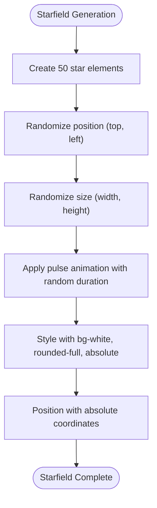
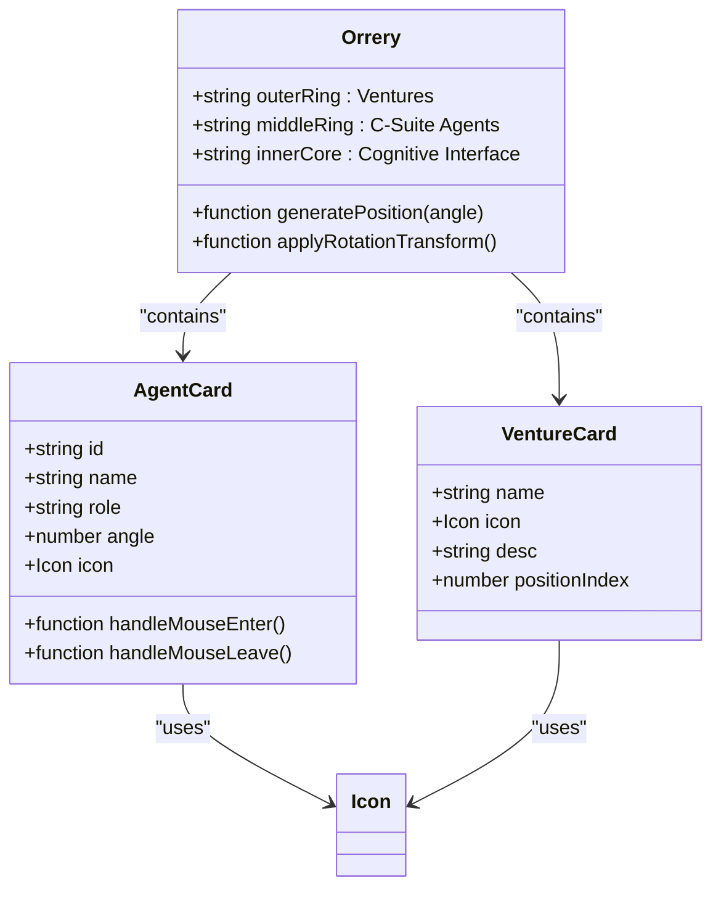
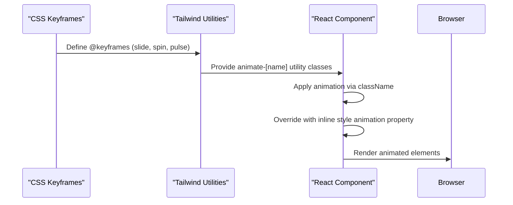
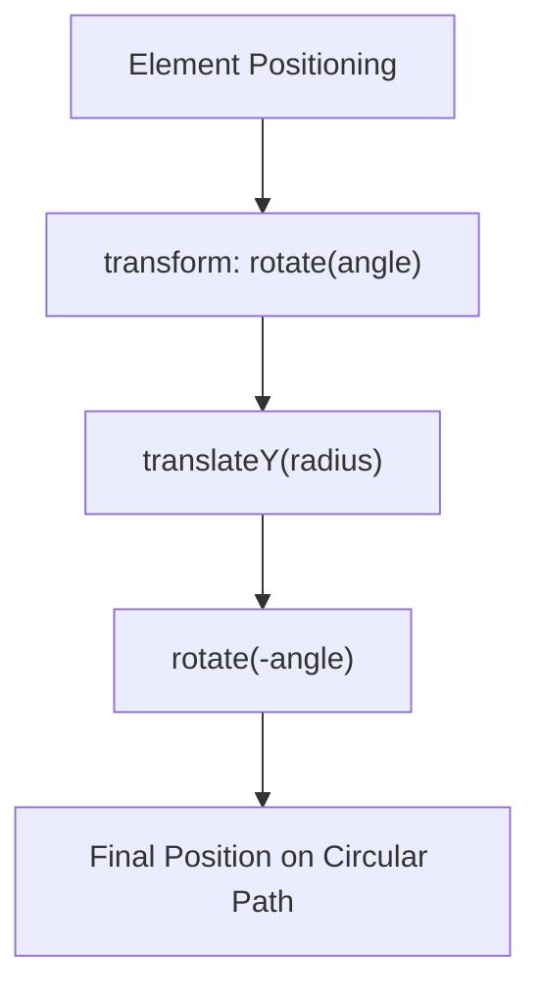

# Styling and Visual Design

<cite>
**Referenced Files in This Document**   
- [index.css](file://src/index.css)
- [App.tsx](file://src/App.tsx)
- [frontend.tsx](file://src/frontend.tsx)
- [package.json](file://package.json)
- [bunfig.toml](file://bunfig.toml)
</cite>

## Table of Contents
1. [Introduction](#introduction)
2. [Core Styling Architecture](#core-styling-architecture)
3. [Visual Elements Implementation](#visual-elements-implementation)
4. [Animation System](#animation-system)
5. [Responsive Design Approach](#responsive-design-approach)
6. [State-Based Styling](#state-based-styling)
7. [Design System Extension Guidelines](#design-system-extension-guidelines)
8. [Conclusion](#conclusion)

## Introduction
This document details the styling architecture of the 371-OS Universe interface, focusing on the implementation of visual elements using Tailwind CSS utility classes. The system combines utility-first CSS principles with custom animations and responsive design patterns to create an immersive cognitive-aware agent operating system interface. The documentation covers the starfield background, orrery rings, agent cards, mode indicators, and their interactive behaviors.

**Section sources**
- [App.tsx](file://src/App.tsx#L50-L206)
- [index.css](file://src/index.css#L1-L188)

## Core Styling Architecture
The styling architecture implements a utility-first approach using Tailwind CSS classes directly in JSX components. The design system establishes a consistent visual language through a combination of color palettes, spacing scales, and typography rules. The base styling is defined in index.css, which sets global variables for fonts, colors, and layout behaviors, while component-specific styles are implemented using Tailwind's responsive and state-aware utility classes.

The color scheme primarily uses a dark theme with slate-based backgrounds (#242424) and text colors that provide high contrast for readability. Accent colors are applied through Tailwind's color palette, with blue, emerald, and purple used to differentiate modes and interactive elements. The architecture leverages CSS custom properties and Tailwind's theme configuration to maintain consistency across components.

**Section sources**
- [index.css](file://src/index.css#L1-L27)
- [App.tsx](file://src/App.tsx#L51-L52)

## Visual Elements Implementation

### Starfield Background
The starfield background creates a cosmic atmosphere through dynamically generated elements styled with Tailwind utility classes. Each star is rendered as a small, rounded div with absolute positioning, white background, and random opacity. The implementation uses JavaScript to generate 50 stars with randomized positions, sizes, and animation durations, creating a depth effect that simulates a starfield in space.

**Diagram sources**
- [App.tsx](file://src/App.tsx#L53-L67)

### Orrery Rings and Agent Cards
The orrery visualization consists of three concentric rings representing different system layers: ventures (outer), C-suite agents (middle), and cognitive interface (inner). Each ring is implemented as a circular div with border styling and rotation transforms to position elements around the circumference.

The agent cards are positioned using CSS transforms that combine rotation and translation to place them equidistantly around the middle ring. Each card uses a consistent design language with a dark background (bg-slate-900/80), backdrop blur effect, and subtle borders. The cards display agent icons and abbreviated names, with hover states that enhance visibility through scale transformation and color changes.

**Diagram sources**
- [App.tsx](file://src/App.tsx#L80-L114)
- [App.tsx](file://src/App.tsx#L84-L97)

### Mode Indicators and Cognitive Interface
The central cognitive interface serves as the mode indicator, displaying the current operational mode (Executive, Technical, Creative) with distinct visual styling for each state. The implementation uses a configuration object that maps each mode to specific Tailwind classes for color, background, border, and icon.

The interface core is a rounded div with conditional classes that change based on the active mode, creating a cohesive visual identity for each operational state. Mode toggles are implemented as buttons with conditional styling that highlights the active mode through background color, border, and text color changes.

**Section sources**
- [App.tsx](file://src/App.tsx#L29-L33)
- [App.tsx](file://src/App.tsx#L117-L140)

## Animation System

### CSS Keyframe Animations
The system implements several keyframe animations defined in index.css and referenced through Tailwind's animation utilities. The primary animations include:

- **Slide animation**: A continuous background movement that creates depth in the interface
- **Spin animation**: A 360-degree rotation used for logo elements and orrery rings
- **Pulse animation**: A breathing effect applied to stars and interactive elements

These animations are defined using standard CSS @keyframes rules and applied through Tailwind's animate utility classes or direct animation properties in inline styles.

**Diagram sources**
- [index.css](file://src/index.css#L28-L34)
- [index.css](file://src/index.css#L72-L78)
- [App.tsx](file://src/App.tsx#L67)
- [App.tsx](file://src/App.tsx#L83)

### Interactive Animations
Interactive animations respond to user actions such as hover, focus, and state changes. The system implements these through Tailwind's state variant classes (hover:, focus:, group-hover:) and React state management.

Hover effects on agent cards include:
- Scale transformation (hover:scale-110)
- Border color change (hover:border-emerald-400)
- Shadow enhancement (hover:shadow-[0_0_20px_rgba(52,211,153,0.3)])

Button interactions use transition-all to create smooth property changes and include subtle translateY transformations to provide tactile feedback.

**Section sources**
- [App.tsx](file://src/App.tsx#L107-L110)
- [App.tsx](file://src/App.tsx#L158-L161)
- [index.css](file://src/index.css#L57-L59)

## Responsive Design Approach

### Fixed Dimensions for Orrery
The orrery maintains fixed dimensions (600px × 600px) for the main container and proportional sizes for inner rings (400px diameter for middle ring). This fixed sizing ensures consistent spatial relationships between elements regardless of screen size, preserving the orbital mechanics metaphor.

The fixed dimensions are implemented using Tailwind's w-[600px] and h-[600px] classes, with inner elements sized relative to the container. This approach prioritizes visual consistency over fluid responsiveness for the core visualization.

**Section sources**
- [App.tsx](file://src/App.tsx#L80)

### Relative Positioning of Elements
Elements within the orrery are positioned using CSS transforms that combine rotation and translation. This technique allows precise placement of elements along circular paths by:

1. Rotating the element to its angular position
2. Translating it outward from the center
3. Counter-rotating to maintain proper orientation

The positioning formula uses the transform property with rotate() and translateY() functions, where the translation distance corresponds to the ring radius (280px for outer ring, 200px for middle ring).

**Diagram sources**
- [App.tsx](file://src/App.tsx#L89)
- [App.tsx](file://src/App.tsx#L108)

## State-Based Styling

### Conditional Class Application
The styling system implements dynamic visual states through conditional class application based on component state. The mode system uses a configuration object (modes) that maps each mode to its corresponding Tailwind classes for color, background, border, and text styling.

Conditional classes are applied using template literals and ternary operators within the className attribute. For example, the mode toggle buttons use different class combinations based on whether the mode is active, with active states receiving color and border enhancements.

**Section sources**
- [App.tsx](file://src/App.tsx#L29-L33)
- [App.tsx](file://src/App.tsx#L135-L136)

### Active Mode Visualization
The active mode is visualized through multiple coordinated styling changes:
- Brain icon color changes according to the active mode
- Core container background and border colors update
- Mode indicator text reflects the current mode
- Pulse animation intensity varies with mode state

These changes create a cohesive visual identity for each operational mode, helping users understand the system's current state.

**Section sources**
- [App.tsx](file://src/App.tsx#L117-L127)

## Design System Extension Guidelines

### Color Palette Consistency
When extending the design system, maintain consistency with the established color palette:
- Use slate-950 for primary backgrounds
- Apply accent colors (blue-400, emerald-400, purple-400) for interactive elements
- Use slate-200 for primary text and slate-400 for secondary text
- Maintain opacity levels (10% for backgrounds, 50% for borders) for visual hierarchy

### Animation Patterns
Follow established animation patterns when adding new elements:
- Use pulse animations for ambient elements
- Apply spin animations for orbital mechanics
- Implement scale transformations for hover states
- Maintain 2000ms intervals for state-based animations
- Respect prefers-reduced-motion by avoiding animations when specified

### Component Structure
New components should follow the established structural patterns:
- Use absolute positioning for elements in the orrery
- Apply backdrop-blur-md for semi-transparent containers
- Include transition-all for smooth state changes
- Use z-index layers to manage stacking context
- Implement responsive fallbacks for smaller screens

## Conclusion
The styling architecture of the 371-OS Universe interface demonstrates a sophisticated implementation of Tailwind CSS utility classes combined with custom animations and responsive design principles. The system effectively uses utility-first CSS to create a visually rich, interactive experience that represents a cognitive-aware agent operating system. By leveraging Tailwind's state variants, responsive prefixes, and animation utilities, the implementation achieves a high degree of visual consistency and interactivity while maintaining code readability and maintainability.

The combination of fixed dimensions for the core visualization with relative positioning and dynamic styling creates a balanced design that is both aesthetically pleasing and functionally effective. The state-based styling system allows for clear visual feedback of the system's operational mode, enhancing user understanding of the interface's behavior.