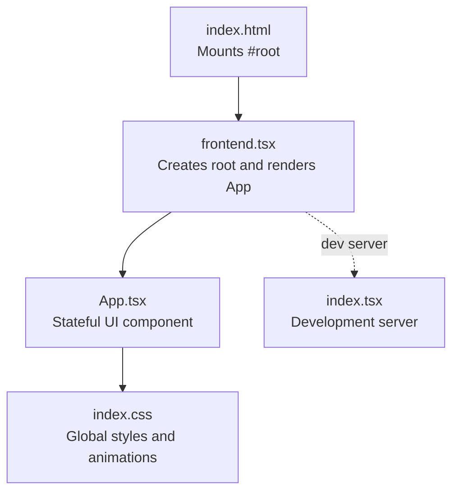
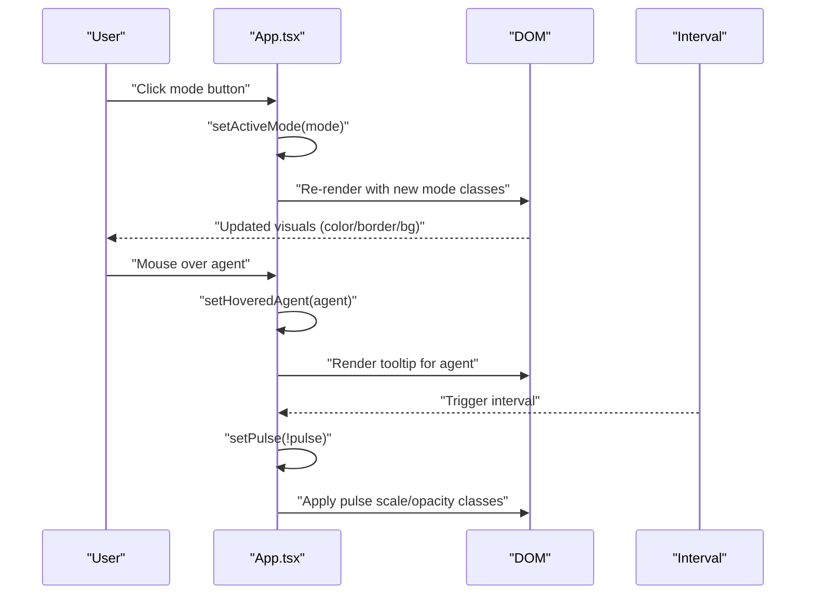
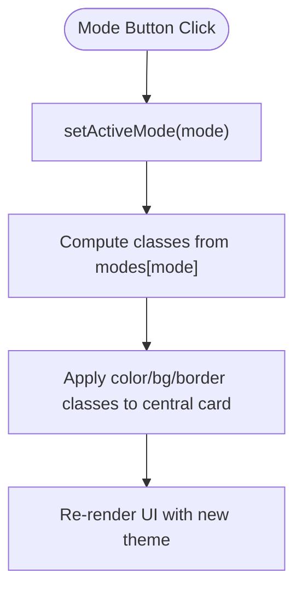
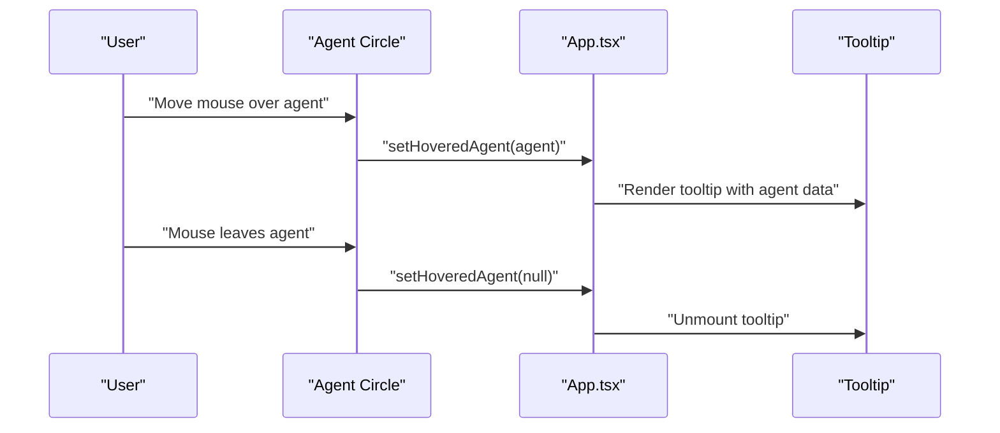
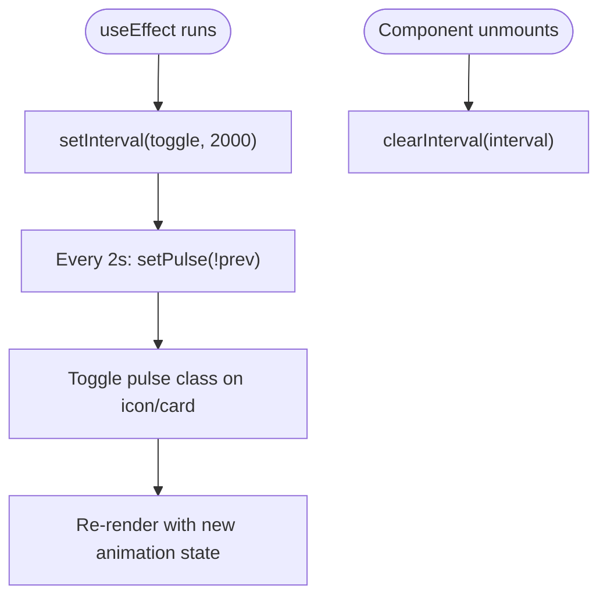
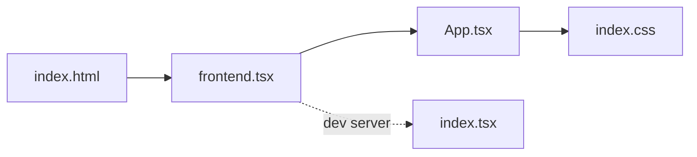

# UI State Management

<cite>
**Referenced Files in This Document**
- [App.tsx](file://src/App.tsx)
- [frontend.tsx](file://src/frontend.tsx)
- [index.html](file://src/index.html)
- [index.css](file://src/index.css)
- [index.tsx](file://src/index.tsx)
- [APITester.tsx](file://src/APITester.tsx)
</cite>

## Table of Contents
1. [Introduction](#introduction)
2. [Project Structure](#project-structure)
3. [Core Components](#core-components)
4. [Architecture Overview](#architecture-overview)
5. [Detailed Component Analysis](#detailed-component-analysis)
6. [Dependency Analysis](#dependency-analysis)
7. [Performance Considerations](#performance-considerations)
8. [Troubleshooting Guide](#troubleshooting-guide)
9. [Conclusion](#conclusion)

## Introduction
This document explains the UI state management pattern used in the frontend, focusing on how React’s useState and useEffect hooks manage activeMode, hoveredAgent, and pulse states. It details how state changes propagate through the component tree to trigger re-renders, how mode selection affects visual styling (color, background, border), how agent hover interactions drive tooltip rendering, and how the pulse animation timing is controlled. It also provides best practices for state co-location, avoiding unnecessary re-renders, and cleaning up side effects.

## Project Structure
The application is a React app bundled with Bun. The entry point mounts the App component into the DOM. The App component encapsulates all interactive state and UI logic.

**Diagram sources**
- [index.html](file://src/index.html#L1-L14)
- [frontend.tsx](file://src/frontend.tsx#L1-L27)
- [App.tsx](file://src/App.tsx#L1-L206)
- [index.css](file://src/index.css#L1-L188)
- [index.tsx](file://src/index.tsx#L1-L42)

**Section sources**
- [index.html](file://src/index.html#L1-L14)
- [frontend.tsx](file://src/frontend.tsx#L1-L27)
- [App.tsx](file://src/App.tsx#L1-L206)
- [index.css](file://src/index.css#L1-L188)
- [index.tsx](file://src/index.tsx#L1-L42)

## Core Components
- App: The primary stateful component that manages:
  - activeMode: selected operational mode driving visual theme
  - hoveredAgent: currently hovered agent for tooltip display
  - pulse: toggled periodically to animate the central cognitive interface
- Effects:
  - useEffect initializes a periodic interval to toggle pulse, with cleanup to clear the interval on unmount.

Key state initialization and updates:
- State initialization: [useState usage](file://src/App.tsx#L19-L27)
- Mode selection update: [setActiveMode on click](file://src/App.tsx#L130-L140)
- Hover update: [setHoveredAgent on mouse enter/leave](file://src/App.tsx#L102-L114)
- Pulse effect: [useEffect interval and cleanup](file://src/App.tsx#L24-L27)

Propagation and re-rendering:
- State changes cause re-renders of the App subtree, updating class names and conditional rendering of tooltips.

**Section sources**
- [App.tsx](file://src/App.tsx#L19-L27)
- [App.tsx](file://src/App.tsx#L102-L114)
- [App.tsx](file://src/App.tsx#L130-L140)
- [App.tsx](file://src/App.tsx#L24-L27)

## Architecture Overview
The state management follows a centralized pattern within App. The component holds all UI state and derives visual styling from activeMode. Event handlers update state, and React re-renders the affected parts of the tree. Conditional rendering displays the tooltip when hoveredAgent is set.

**Diagram sources**
- [App.tsx](file://src/App.tsx#L130-L140)
- [App.tsx](file://src/App.tsx#L102-L114)
- [App.tsx](file://src/App.tsx#L24-L27)

## Detailed Component Analysis

### State Initialization and Updates
- activeMode: initialized to a default mode and updated via button clicks. The mode determines color, background, and border classes applied to the central cognitive interface.
- hoveredAgent: initialized to null; set on mouse enter and cleared on mouse leave for each agent.
- pulse: initialized to false and toggled every 2 seconds by an interval created in useEffect.

State initialization and updates are defined in the component body and event handlers.

**Section sources**
- [App.tsx](file://src/App.tsx#L19-L27)
- [App.tsx](file://src/App.tsx#L102-L114)
- [App.tsx](file://src/App.tsx#L130-L140)
- [App.tsx](file://src/App.tsx#L24-L27)

### Mode Selection and Visual Styling
- Modes are defined as a mapping keyed by mode name to an object containing color, background, border, icon, and description.
- The central cognitive interface applies:
  - Color classes for icons and text
  - Background classes for the card
  - Border classes for the ring
- Mode buttons conditionally apply active classes based on whether the button’s mode equals activeMode.

**Diagram sources**
- [App.tsx](file://src/App.tsx#L29-L33)
- [App.tsx](file://src/App.tsx#L116-L141)
- [App.tsx](file://src/App.tsx#L130-L140)

**Section sources**
- [App.tsx](file://src/App.tsx#L29-L33)
- [App.tsx](file://src/App.tsx#L116-L141)
- [App.tsx](file://src/App.tsx#L130-L140)

### Agent Hover Interactions and Tooltip Display
- Each agent circle registers mouse enter/leave handlers to set/unset hoveredAgent.
- A floating tooltip appears when hoveredAgent is truthy, displaying agent details.

**Diagram sources**
- [App.tsx](file://src/App.tsx#L102-L114)
- [App.tsx](file://src/App.tsx#L162-L179)

**Section sources**
- [App.tsx](file://src/App.tsx#L102-L114)
- [App.tsx](file://src/App.tsx#L162-L179)

### Pulse Animation Timing
- useEffect creates an interval that toggles pulse every 2 seconds.
- The central brain icon and surrounding card react to pulse by adjusting scale and opacity classes.
- Cleanup clears the interval when the component unmounts.

**Diagram sources**
- [App.tsx](file://src/App.tsx#L24-L27)
- [App.tsx](file://src/App.tsx#L116-L128)

**Section sources**
- [App.tsx](file://src/App.tsx#L24-L27)
- [App.tsx](file://src/App.tsx#L116-L128)

### State Co-location and Propagation
- activeMode, hoveredAgent, and pulse are co-located in App, minimizing prop drilling and simplifying state access for all UI elements.
- State changes trigger re-renders of the component subtree. The central card and tooltip are the primary consumers of these states.

Best practices demonstrated:
- Keep state close to where it is used.
- Use derived values (classes) from state to drive UI.
- Clean up intervals in useEffect.

**Section sources**
- [App.tsx](file://src/App.tsx#L19-L27)
- [App.tsx](file://src/App.tsx#L24-L27)

## Dependency Analysis
- App depends on React for hooks and renders the UI.
- frontend.tsx depends on App to render into the DOM.
- index.html provides the mount point.
- index.css provides global styles and animations used by App.
- index.tsx is a development server and not part of the UI state logic.

**Diagram sources**
- [index.html](file://src/index.html#L1-L14)
- [frontend.tsx](file://src/frontend.tsx#L1-L27)
- [App.tsx](file://src/App.tsx#L1-L206)
- [index.css](file://src/index.css#L1-L188)
- [index.tsx](file://src/index.tsx#L1-L42)

**Section sources**
- [index.html](file://src/index.html#L1-L14)
- [frontend.tsx](file://src/frontend.tsx#L1-L27)
- [App.tsx](file://src/App.tsx#L1-L206)
- [index.css](file://src/index.css#L1-L188)
- [index.tsx](file://src/index.tsx#L1-L42)

## Performance Considerations
- Avoid unnecessary re-renders:
  - Keep state minimal and co-located in App.
  - Use memoized derived values if the mode map grows large (not shown in current code).
- Interval lifecycle:
  - The interval is created and cleared in useEffect, preventing memory leaks.
- Conditional rendering:
  - Tooltip only renders when hoveredAgent is set, reducing DOM overhead.
- CSS transitions:
  - Transitions and opacity changes are GPU-friendly and efficient.

[No sources needed since this section provides general guidance]

## Troubleshooting Guide
- Pulse animation not stopping:
  - Ensure useEffect cleanup clears the interval on unmount.
  - Verify the interval is recreated only once by passing an empty dependency array.
- Tooltip not appearing:
  - Confirm mouse enter/leave handlers are attached to agent circles.
  - Ensure hoveredAgent is truthy when the tooltip should show.
- Mode classes not updating:
  - Verify activeMode is updated via button clicks.
  - Confirm the mode map keys match the button values.

**Section sources**
- [App.tsx](file://src/App.tsx#L24-L27)
- [App.tsx](file://src/App.tsx#L102-L114)
- [App.tsx](file://src/App.tsx#L130-L140)

## Conclusion
The App component demonstrates a clean, centralized state management pattern using React hooks. activeMode, hoveredAgent, and pulse are co-located and drive visual styling, conditional rendering, and animation timing. The useEffect hook ensures the pulse interval is properly managed with cleanup. Event handlers keep the UI responsive and interactive, while conditional rendering minimizes unnecessary DOM work. This approach scales well for small to medium applications and keeps state logic close to where it is used.