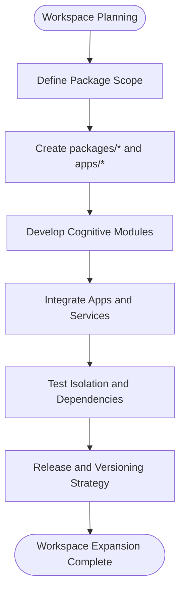

# Future Roadmap

<cite>
**Referenced Files in This Document**
- [package.json](file://package.json)
- [projectinfo.md](file://projectinfo.md)
- [README.md](file://README.md)
- [bunfig.toml](file://bunfig.toml)
- [tsconfig.json](file://tsconfig.json)
- [src/index.tsx](file://src/index.tsx)
- [src/App.tsx](file://src/App.tsx)
- [src/frontend.tsx](file://src/frontend.tsx)
- [src/APITester.tsx](file://src/APITester.tsx)
- [AB/conceptual.md](file://AB/conceptual.md)
</cite>

## Table of Contents
1. [Introduction](#introduction)
2. [Project Structure](#project-structure)
3. [Core Components](#core-components)
4. [Architecture Overview](#architecture-overview)
5. [Detailed Component Analysis](#detailed-component-analysis)
6. [Dependency Analysis](#dependency-analysis)
7. [Performance Considerations](#performance-considerations)
8. [Troubleshooting Guide](#troubleshooting-guide)
9. [Conclusion](#conclusion)
10. [Appendices](#appendices)

## Introduction
This document outlines the future development directions for the project, focusing on the planned expansion of monorepo workspaces, upcoming features such as enhanced agent coordination protocols and advanced cognitive processing capabilities, and the vision for integrating blockchain DAO governance to increase system autonomy. It also addresses technical debt considerations, potential architecture evolution, community contribution opportunities, extension points for third-party developers, timelines and milestones, backward compatibility plans, and migration strategies for future breaking changes. The content synthesizes insights from the repository’s configuration and documentation to present a practical roadmap aligned with the existing cognitive-aware framework.

## Project Structure
The repository follows a monorepo layout with workspaces configured to manage packages and applications. The current workspace configuration defines two primary areas:
- packages/*: intended for reusable libraries and shared modules
- apps/*: intended for application binaries or services

This structure enables modular development, dependency isolation, and scalable distribution of features across the cognitive-aware operating system.

**Diagram sources**
- [package.json](file://package.json#L1-L31)
- [projectinfo.md](file://projectinfo.md#L56-L60)

**Section sources**
- [package.json](file://package.json#L1-L31)
- [projectinfo.md](file://projectinfo.md#L56-L60)

## Core Components
- Monorepo Workspaces: The workspace configuration signals the intent to expand into dedicated packages and applications, enabling feature modularity and team autonomy.
- Cognitive Dashboard: The React-based dashboard visualizes operational modes, agents, and ventures, forming the core user interface for cognitive-aware orchestration.
- Lightweight API Server: A minimal Bun-based server exposes endpoints for testing and future integration points.
- Build and Runtime Configuration: Bun configuration and TypeScript settings define the development and production runtime characteristics.

These components collectively support the cognitive-aware framework and provide the foundation for future enhancements.

**Section sources**
- [package.json](file://package.json#L1-L31)
- [src/App.tsx](file://src/App.tsx#L1-L205)
- [src/index.tsx](file://src/index.tsx#L1-L42)
- [bunfig.toml](file://bunfig.toml#L1-L17)
- [tsconfig.json](file://tsconfig.json#L1-L18)

## Architecture Overview
The current architecture centers on a cognitive-aware dashboard and a lightweight API server. The monorepo structure allows for:
- Feature isolation via packages
- Application specialization via apps
- Shared cognitive primitives and utilities across modules

**Diagram sources**
- [package.json](file://package.json#L1-L31)
- [src/index.tsx](file://src/index.tsx#L1-L42)
- [src/App.tsx](file://src/App.tsx#L1-L205)
- [src/APITester.tsx](file://src/APITester.tsx#L1-L40)

## Detailed Component Analysis

### Monorepo Workspace Expansion
- Purpose: Enable scalable feature development by organizing shared modules and applications under packages and apps workspaces.
- Scope: Plan to add new packages for cognitive primitives, agent coordination protocols, and venture-specific modules.
- Impact: Improved modularity, reduced coupling, and clearer ownership boundaries across teams.

**Section sources**
- [package.json](file://package.json#L1-L31)
- [projectinfo.md](file://projectinfo.md#L56-L60)

### Enhanced Agent Coordination Protocols
- Objective: Strengthen inter-agent communication and decision-making within the cognitive-aware framework.
- Approach: Introduce protocol layers for message routing, consensus mechanisms, and cross-agent synchronization.
- Integration: Align with the dashboard’s agent visualization and mode toggles to reflect coordination outcomes.

**Diagram sources**
- [src/App.tsx](file://src/App.tsx#L1-L205)

**Section sources**
- [projectinfo.md](file://projectinfo.md#L87-L91)

### Advanced Cognitive Processing Capabilities
- Objective: Elevate the dashboard’s cognitive interface to support richer reasoning, planning, and adaptive behavior.
- Approach: Extend the cognitive modes and agent roles to incorporate dynamic planning and feedback loops.
- Integration: Visualize cognitive processing outcomes in real-time within the dashboard.

**Section sources**
- [projectinfo.md](file://projectinfo.md#L87-L91)
- [src/App.tsx](file://src/App.tsx#L1-L205)

### Venture Modules Expansion
- Objective: Add new venture modules to the cognitive-aware operating system.
- Approach: Introduce new venture categories and integrate them into the dashboard’s visualization and coordination layers.
- Integration: Leverage the existing dashboard structure to display new ventures alongside existing ones.

**Section sources**
- [projectinfo.md](file://projectinfo.md#L87-L91)
- [src/App.tsx](file://src/App.tsx#L1-L205)

### Blockchain DAO Governance Integration
- Vision: Integrate blockchain-based governance to enhance system autonomy and decentralized decision-making.
- Impact: Shift operational decisions toward DAO-driven consensus, aligning with the dashboard’s coordination layer and agent roles.
- Alignment: Ensure governance outcomes feed into the cognitive-aware framework for transparent, traceable orchestration.

**Section sources**
- [projectinfo.md](file://projectinfo.md#L44-L48)
- [src/App.tsx](file://src/App.tsx#L143-L159)

### API Surface and Testing
- Current API Server: Provides basic endpoints for testing and development.
- Future Enhancements: Expand endpoints to expose cognitive orchestration APIs, governance actions, and venture management interfaces.
- Integration: Use the API tester component to validate new endpoints during development.

**Diagram sources**
- [src/index.tsx](file://src/index.tsx#L1-L42)
- [src/APITester.tsx](file://src/APITester.tsx#L1-L40)

**Section sources**
- [src/index.tsx](file://src/index.tsx#L1-L42)
- [src/APITester.tsx](file://src/APITester.tsx#L1-L40)

### Frontend Entry and Hot Reload
- Entry Point: The React frontend initializes the dashboard and supports hot module replacement for rapid iteration.
- Extension Points: New cognitive features can be integrated via modular components and route-based loading.

**Section sources**
- [src/frontend.tsx](file://src/frontend.tsx#L1-L27)
- [src/App.tsx](file://src/App.tsx#L1-L205)

## Dependency Analysis
- Monorepo Coupling: Workspaces reduce direct coupling by isolating packages and apps, enabling independent evolution.
- External Dependencies: The project relies on Bun runtime, React, and related ecosystem tools. Upcoming features should leverage these dependencies while maintaining compatibility.
- Governance Integration: DAO-related features will introduce new external integrations (blockchain clients, governance SDKs) that must be carefully managed to avoid coupling.

**Section sources**
- [package.json](file://package.json#L1-L31)
- [projectinfo.md](file://projectinfo.md#L44-L48)

## Performance Considerations
- Runtime Optimization: The Bun configuration targets performance improvements and environment tuning suitable for cognitive workloads.
- Build Targets: TypeScript configuration and bundler settings should accommodate evolving cognitive features without sacrificing build performance.
- Scalability: As workspaces grow, ensure dependency graphs remain shallow and modular to prevent performance regressions.

**Section sources**
- [bunfig.toml](file://bunfig.toml#L1-L17)
- [tsconfig.json](file://tsconfig.json#L1-L18)

## Troubleshooting Guide
- Development Server Issues: Verify the development script and hot reload settings in the configuration files.
- API Testing: Use the API tester component to validate endpoint responses and troubleshoot connectivity.
- Dashboard Rendering: Confirm the frontend entry point and React rendering pipeline for consistent behavior.

**Section sources**
- [README.md](file://README.md#L1-L22)
- [src/APITester.tsx](file://src/APITester.tsx#L1-L40)
- [src/frontend.tsx](file://src/frontend.tsx#L1-L27)

## Conclusion
The project’s future roadmap emphasizes expanding the monorepo workspaces, enhancing agent coordination and cognitive processing, integrating blockchain DAO governance, and scaling venture modules. By leveraging the existing cognitive-aware framework and the current workspace structure, the system can evolve toward greater autonomy and modularity. Careful attention to technical debt, architecture evolution, backward compatibility, and community contributions will ensure sustainable growth.

## Appendices

### Community Contribution Opportunities
- Workspace Contributions: Contribute new packages and apps under the workspaces configuration.
- Cognitive Extensions: Propose enhancements to the dashboard and coordination protocols.
- Governance Integration: Collaborate on DAO-related integrations and standards.
- Documentation and Tooling: Improve developer experience with tests, linting, and build tooling.

**Section sources**
- [package.json](file://package.json#L1-L31)
- [projectinfo.md](file://projectinfo.md#L87-L91)

### Extension Points for Third-Party Developers
- Cognitive Modules: Extend cognitive processing via new packages in packages/*.
- Venture Integrations: Add new venture modules that align with the dashboard’s visualization and coordination layers.
- API Extensions: Expand the API server with endpoints for governance actions and cognitive orchestration.
- Governance Adapters: Provide adapters for DAO platforms and governance frameworks.

**Section sources**
- [package.json](file://package.json#L1-L31)
- [src/index.tsx](file://src/index.tsx#L1-L42)
- [src/App.tsx](file://src/App.tsx#L1-L205)

### Timelines and Milestones
- Short-term (Q1): Finalize workspace structure and initial package scaffolding.
- Mid-term (Q2): Implement enhanced agent coordination protocols and cognitive processing extensions.
- Long-term (Q3+): Integrate blockchain DAO governance and release expanded venture modules.

[No sources needed since this section provides general guidance]

### Backward Compatibility and Migration Strategies
- Versioning: Adopt semantic versioning for packages and apps to signal breaking changes.
- Deprecation Policy: Announce deprecations early and provide migration guides.
- Incremental Changes: Prefer additive changes where possible; isolate breaking changes behind feature flags.
- Testing: Maintain comprehensive tests for cognitive workflows and governance integrations.

[No sources needed since this section provides general guidance]