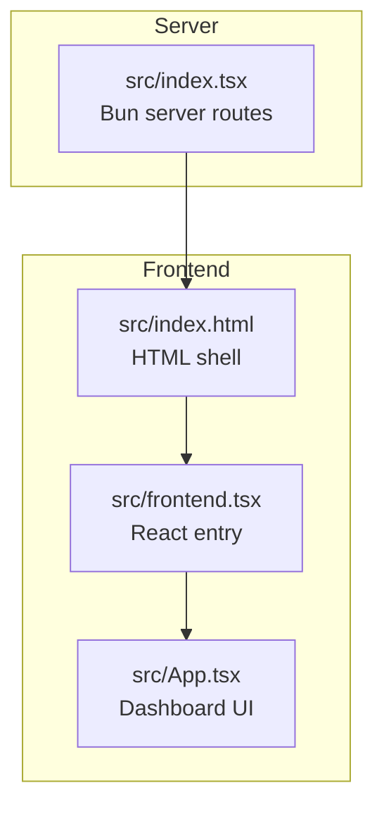
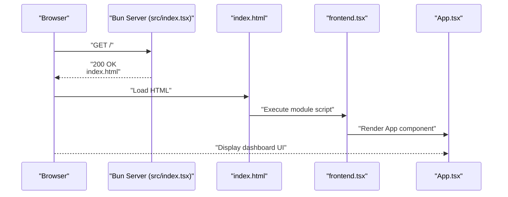
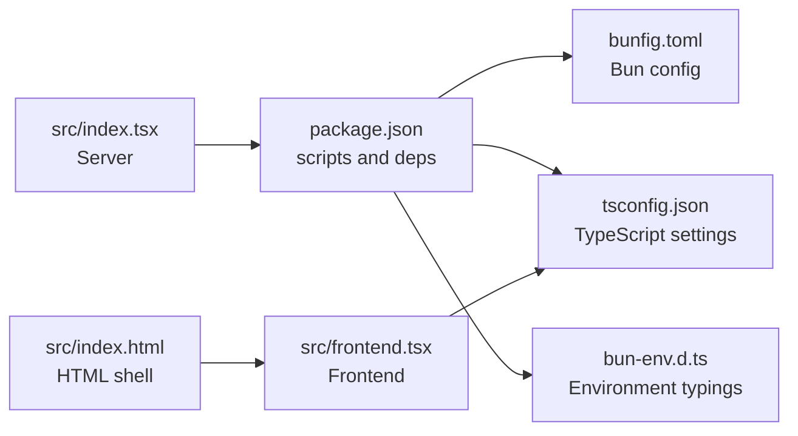

# Getting Started

<cite>
**Referenced Files in This Document**
- [README.md](file://README.md)
- [projectinfo.md](file://projectinfo.md)
- [package.json](file://package.json)
- [bunfig.toml](file://bunfig.toml)
- [tsconfig.json](file://tsconfig.json)
- [bun-env.d.ts](file://bun-env.d.ts)
- [src/index.tsx](file://src/index.tsx)
- [src/frontend.tsx](file://src/frontend.tsx)
- [src/index.html](file://src/index.html)
</cite>

## Table of Contents
1. [Introduction](#introduction)
2. [Project Structure](#project-structure)
3. [Core Components](#core-components)
4. [Architecture Overview](#architecture-overview)
5. [Detailed Component Analysis](#detailed-component-analysis)
6. [Dependency Analysis](#dependency-analysis)
7. [Performance Considerations](#performance-considerations)
8. [Troubleshooting Guide](#troubleshooting-guide)
9. [Conclusion](#conclusion)
10. [Appendices](#appendices)

## Introduction
This guide helps new developers quickly set up and run the project locally using Bun. You will clone the repository, install dependencies, start the development server, and run in production. It also covers environment-specific considerations for Windows, macOS, and Linux, plus practical verification steps to confirm the setup is working.

## Project Structure
At a high level, the project consists of:
- A Bun-powered server that serves static HTML and exposes a small API.
- A React frontend that renders inside the served HTML page.
- Configuration files for Bun, TypeScript, and environment typing.

**Diagram sources**
- [src/index.tsx](file://src/index.tsx#L1-L42)
- [src/index.html](file://src/index.html#L1-L14)
- [src/frontend.tsx](file://src/frontend.tsx#L1-L27)

**Section sources**
- [README.md](file://README.md#L1-L22)
- [projectinfo.md](file://projectinfo.md#L1-L91)
- [src/index.tsx](file://src/index.tsx#L1-L42)
- [src/index.html](file://src/index.html#L1-L14)
- [src/frontend.tsx](file://src/frontend.tsx#L1-L27)

## Core Components
- Bun server entrypoint: src/index.tsx initializes the server, defines routes, and enables development features like hot module replacement and console mirroring.
- Frontend entrypoint: src/frontend.tsx mounts the React App into the DOM and supports hot reloading during development.
- HTML shell: src/index.html includes the React script module and provides the root container for the app.

Key responsibilities:
- src/index.tsx: Starts the server, serves index.html for unmatched routes, exposes a simple API under /api/hello, and toggles development features.
- src/frontend.tsx: Creates the React root and renders the App component, with hot reload support.
- src/index.html: Minimal HTML scaffold with a #root element and a module script pointing to the frontend entry.

**Section sources**
- [src/index.tsx](file://src/index.tsx#L1-L42)
- [src/frontend.tsx](file://src/frontend.tsx#L1-L27)
- [src/index.html](file://src/index.html#L1-L14)

## Architecture Overview
The runtime architecture is straightforward: the Bun server serves static HTML and acts as a lightweight API gateway. The browser loads the HTML, which in turn loads the frontend entrypoint. The frontend renders the dashboard UI.

**Diagram sources**
- [src/index.tsx](file://src/index.tsx#L1-L42)
- [src/index.html](file://src/index.html#L1-L14)
- [src/frontend.tsx](file://src/frontend.tsx#L1-L27)

## Detailed Component Analysis

### Bun Server Initialization (src/index.tsx)
- Purpose: Initializes the Bun server, serves index.html for all unmatched routes, and exposes a small API under /api/hello.
- Development features: Hot module replacement and console mirroring are enabled when not in production.
- Output: Logs the server URL upon startup.

Verification steps:
- After starting the server, open the logged URL in a browser to see the dashboard.
- Call the API endpoints to confirm they return JSON responses.

**Section sources**
- [src/index.tsx](file://src/index.tsx#L1-L42)

### Frontend Entry Point (src/frontend.tsx)
- Purpose: Creates the React root and renders the App component. Supports hot module replacement during development.
- Behavior: Uses import.meta.hot to persist the root instance across reloads.

**Section sources**
- [src/frontend.tsx](file://src/frontend.tsx#L1-L27)

### HTML Shell (src/index.html)
- Purpose: Provides the minimal HTML scaffold with a #root element and loads the frontend entry as a module script.

**Section sources**
- [src/index.html](file://src/index.html#L1-L14)

## Dependency Analysis
- Bun runtime and package manager: The project uses Bun as both runtime and package manager. Bun configuration and environment variables are defined in bunfig.toml and bun-env.d.ts.
- TypeScript configuration: tsconfig.json sets module resolution to bundler and JSX transform for React.
- Scripts: package.json defines scripts for development, testing, linting, and building.

**Diagram sources**
- [package.json](file://package.json#L1-L31)
- [bunfig.toml](file://bunfig.toml#L1-L17)
- [tsconfig.json](file://tsconfig.json#L1-L18)
- [bun-env.d.ts](file://bun-env.d.ts#L1-L18)
- [src/index.tsx](file://src/index.tsx#L1-L42)
- [src/frontend.tsx](file://src/frontend.tsx#L1-L27)
- [src/index.html](file://src/index.html#L1-L14)

**Section sources**
- [package.json](file://package.json#L1-L31)
- [bunfig.toml](file://bunfig.toml#L1-L17)
- [tsconfig.json](file://tsconfig.json#L1-L18)
- [bun-env.d.ts](file://bun-env.d.ts#L1-L18)

## Performance Considerations
- Use Bun’s native bundler and hot reloading for rapid iteration during development.
- Enable Bun caching and lockfiles to speed up installs.
- Keep development features enabled only in development to avoid overhead in production.

Practical tips:
- Run the development server with hot reloading enabled for instant feedback.
- Use Bun’s built-in test coverage for faster test cycles.
- Leverage Bun’s module resolution and TypeScript settings for efficient builds.

**Section sources**
- [bunfig.toml](file://bunfig.toml#L1-L17)
- [tsconfig.json](file://tsconfig.json#L1-L18)
- [src/index.tsx](file://src/index.tsx#L32-L38)

## Troubleshooting Guide

Common issues and resolutions:
- Bun not installed or not on PATH
  - Install Bun according to platform-specific instructions, then verify with the Bun CLI.
  - Confirm the project’s package manager version is compatible with the local Bun installation.
  - Reference: [README.md](file://README.md#L1-L22), [projectinfo.md](file://projectinfo.md#L60-L70)

- Port conflicts
  - The server logs its URL on startup. If the port is in use, change the port in the server configuration or stop the conflicting service.
  - Reference: [src/index.tsx](file://src/index.tsx#L41-L42)

- Hot reload not working
  - Ensure development mode is active and that hot module replacement is enabled.
  - Reference: [src/index.tsx](file://src/index.tsx#L32-L38)

- TypeScript or module resolution errors
  - Verify TypeScript settings and module resolution align with Bun’s bundler.
  - Reference: [tsconfig.json](file://tsconfig.json#L1-L18)

- Missing environment typings
  - Ensure Bun environment declarations are present.
  - Reference: [bun-env.d.ts](file://bun-env.d.ts#L1-L18)

- Windows-specific considerations
  - Use the official Bun installer for Windows.
  - Some shell commands may differ; prefer PowerShell or Command Prompt as needed.
  - Reference: [README.md](file://README.md#L1-L22)

- macOS-specific considerations
  - Use Homebrew or the official installer to install Bun.
  - If permission errors occur, review file permissions and shell profile configuration.
  - Reference: [README.md](file://README.md#L1-L22)

- Linux-specific considerations
  - Use the official installer script for Linux distributions.
  - Ensure system dependencies are met and PATH is configured correctly.
  - Reference: [README.md](file://README.md#L1-L22)

## Practical Setup Steps

Step-by-step instructions:
1. Clone the repository to your machine.
   - Use your preferred Git client or command-line tool to clone the repository.

2. Install dependencies with Bun.
   - Run the Bun install command to fetch all dependencies.
   - Reference: [README.md](file://README.md#L1-L22)

3. Start the development server with Bun.
   - Run the Bun dev command to launch the server with hot reloading.
   - On startup, the server logs its URL; open this URL in a browser to access the dashboard.
   - Reference: [src/index.tsx](file://src/index.tsx#L41-L42)

4. Run in production with Bun.
   - Use the Bun start command to run the server in production mode.
   - Reference: [README.md](file://README.md#L15-L19), [projectinfo.md](file://projectinfo.md#L66-L70)

5. Verify the setup
   - Access the dashboard in your browser using the URL logged by the server.
   - Test the API endpoints:
     - GET /api/hello
     - PUT /api/hello
     - GET /api/hello/:name
   - Reference: [src/index.tsx](file://src/index.tsx#L9-L30)

Environment-specific considerations:
- Windows
  - Install Bun via the official installer.
  - Use PowerShell or Command Prompt to run commands.
  - Reference: [README.md](file://README.md#L1-L22)

- macOS
  - Install Bun via Homebrew or the official installer.
  - Ensure shell profile updates PATH correctly.
  - Reference: [README.md](file://README.md#L1-L22)

- Linux
  - Install Bun using the official installer script.
  - Confirm PATH and system dependencies.
  - Reference: [README.md](file://README.md#L1-L22)

## Conclusion
You now have the essential steps to clone the repository, install dependencies, start the development server, and run in production. Use the verification steps to confirm everything is working, and consult the troubleshooting section if you encounter issues. For faster development, rely on Bun’s native bundler and hot reloading features.

## Appendices

### Entry Points
- Frontend rendering entry: src/frontend.tsx
  - Purpose: Mounts the React App into the DOM and supports hot reloading.
  - Reference: [src/frontend.tsx](file://src/frontend.tsx#L1-L27)

- Bun server initialization: src/index.tsx
  - Purpose: Starts the server, serves index.html, and exposes API endpoints.
  - Reference: [src/index.tsx](file://src/index.tsx#L1-L42)

### API Endpoints
- GET /api/hello
  - Returns a JSON response with a greeting and method.
  - Reference: [src/index.tsx](file://src/index.tsx#L9-L16)

- PUT /api/hello
  - Returns a JSON response with a greeting and method.
  - Reference: [src/index.tsx](file://src/index.tsx#L16-L22)

- GET /api/hello/:name
  - Returns a JSON response with a personalized greeting.
  - Reference: [src/index.tsx](file://src/index.tsx#L24-L29)

### Development and Production Commands
- Install dependencies: bun install
  - Reference: [README.md](file://README.md#L1-L22)

- Start development server: bun dev
  - Reference: [README.md](file://README.md#L9-L13)

- Run in production: bun start
  - Reference: [README.md](file://README.md#L15-L19), [projectinfo.md](file://projectinfo.md#L66-L70)

### Configuration References
- Bun configuration: bunfig.toml
  - Caching, test coverage, and runtime environment variables.
  - Reference: [bunfig.toml](file://bunfig.toml#L1-L17)

- TypeScript configuration: tsconfig.json
  - Module resolution, JSX transform, and strict settings.
  - Reference: [tsconfig.json](file://tsconfig.json#L1-L18)

- Environment typings: bun-env.d.ts
  - Type declarations for assets and CSS modules.
  - Reference: [bun-env.d.ts](file://bun-env.d.ts#L1-L18)