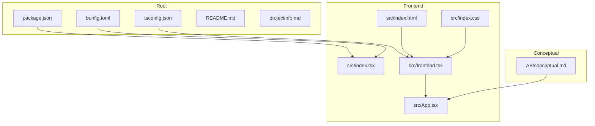
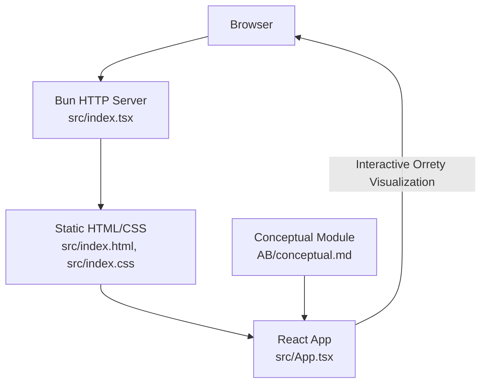
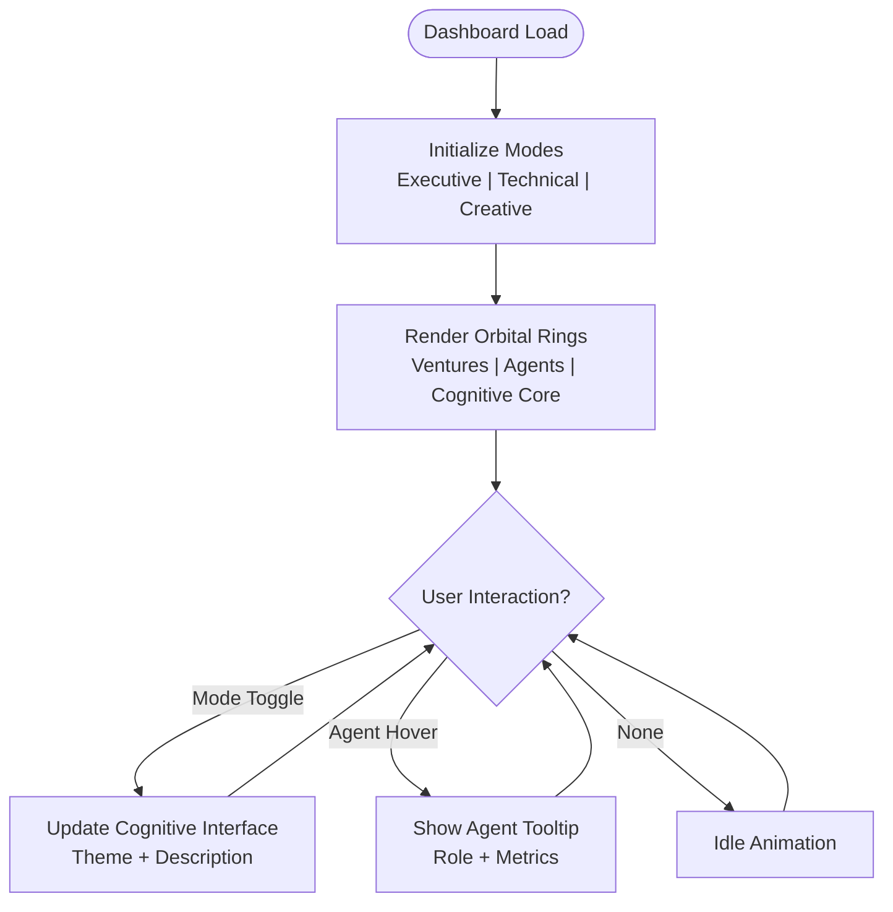
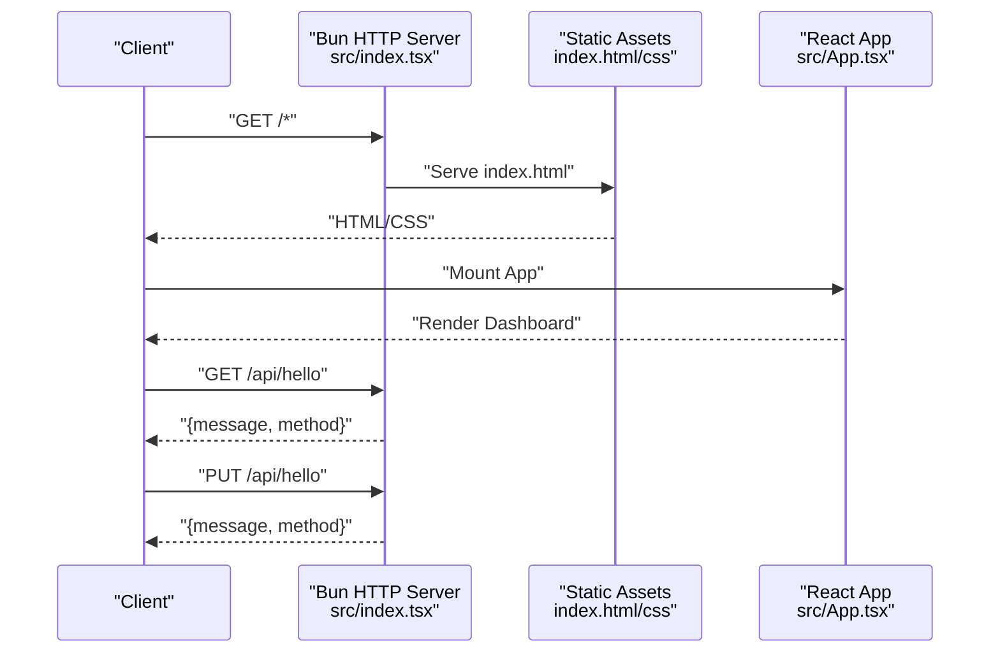
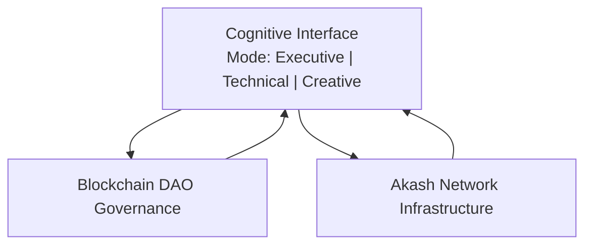
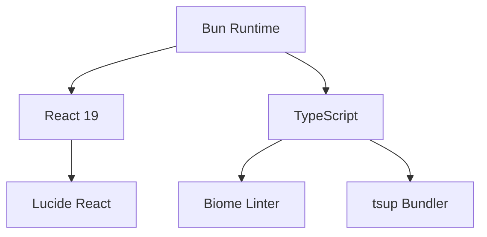

# Project Overview

<cite>
**Referenced Files in This Document**
- [README.md](file://README.md)
- [projectinfo.md](file://projectinfo.md)
- [package.json](file://package.json)
- [bunfig.toml](file://bunfig.toml)
- [tsconfig.json](file://tsconfig.json)
- [src/index.tsx](file://src/index.tsx)
- [src/App.tsx](file://src/App.tsx)
- [src/frontend.tsx](file://src/frontend.tsx)
- [AB/conceptual.md](file://AB/conceptual.md)
</cite>

## Table of Contents
1. [Introduction](#introduction)
2. [Project Structure](#project-structure)
3. [Core Components](#core-components)
4. [Architecture Overview](#architecture-overview)
5. [Detailed Component Analysis](#detailed-component-analysis)
6. [Dependency Analysis](#dependency-analysis)
7. [Performance Considerations](#performance-considerations)
8. [Troubleshooting Guide](#troubleshooting-guide)
9. [Conclusion](#conclusion)

## Introduction
SynchroSource is a cognitive-aware autonomous agent operating system designed to coordinate multiple AI agents across three operational modes: Executive, Technical, and Creative. It presents a conceptual and interactive visualization of agent orchestration, with a dashboard featuring an animated orrery-style layout that positions ventures and C-suite agents around a central cognitive interface. The system emphasizes real-time optimization metrics, mode switching, and a cohesive cognitive interface that reflects the current operational mode.

Key highlights:
- Purpose: World’s first cognitive-aware autonomous agent operating system.
- Modes: Executive (strategic oversight and ROI optimization), Technical (infrastructure and system architecture), Creative (content generation and experience design).
- C-suite agents: CEO Mimi (strategic leadership), CTO Zara (technical architecture), CFO Maya (financial optimization), CLO Sage (legal and governance), CAO Eduardo (admin excellence).
- Managed ventures: LyricLines (AI creative content), Vision2Results (strategic consulting), ModuMind (agent OS core), Ikidedventures (edutainment).
- Infrastructure: Akash Network for cloud infrastructure; blockchain DAO governance for coordination; Bun runtime for performance.
- Rebranding: From “371-OS” to “SynchroSource,” reflecting a broader vision for cognitive-aware agent orchestration.

**Section sources**
- [projectinfo.md](file://projectinfo.md#L1-L91)
- [README.md](file://README.md#L1-L22)

## Project Structure
The repository follows a monorepo-like structure with workspaces configured for packages and apps. The frontend application is implemented with React 19 and TypeScript, served by Bun’s lightweight HTTP server. The dashboard showcases an orrery visualization of ventures and agents, with a central cognitive interface that reflects the active mode.

High-level structure:
- Root configuration: package manager, workspaces, scripts, and runtime settings.
- Frontend: React application entry, dashboard component, and static HTML/CSS assets.
- Conceptual module: A conceptual React component mirroring the dashboard layout and interactions.

**Diagram sources**
- [package.json](file://package.json#L1-L31)
- [bunfig.toml](file://bunfig.toml#L1-L17)
- [tsconfig.json](file://tsconfig.json#L1-L18)
- [src/index.tsx](file://src/index.tsx#L1-L42)
- [src/frontend.tsx](file://src/frontend.tsx#L1-L27)
- [src/App.tsx](file://src/App.tsx#L1-L206)
- [AB/conceptual.md](file://AB/conceptual.md#L1-L205)

**Section sources**
- [package.json](file://package.json#L1-L31)
- [bunfig.toml](file://bunfig.toml#L1-L17)
- [tsconfig.json](file://tsconfig.json#L1-L18)
- [src/index.tsx](file://src/index.tsx#L1-L42)
- [src/frontend.tsx](file://src/frontend.tsx#L1-L27)
- [src/App.tsx](file://src/App.tsx#L1-L206)
- [AB/conceptual.md](file://AB/conceptual.md#L1-L205)

## Core Components
- Cognitive Operating System: SynchroSource (formerly 371-OS), a cognitive-aware autonomous agent OS built on Bun runtime.
- Dashboard: An interactive orrery visualization with three concentric rings:
  - Outer ring: Managed ventures.
  - Middle ring: C-suite agents.
  - Inner core: Cognitive interface representing the active mode.
- Mode Switching: Buttons to toggle between Executive, Technical, and Creative modes, updating the cognitive interface and its visual theme.
- Hover Interactions: Tooltips for C-suite agents with optimization metrics.
- Infrastructure Labels: At the bottom, labels indicate cloud infrastructure (Akash Network) and coordination (blockchain DAO governance).
- API Server: A minimal Bun HTTP server serving static HTML and basic JSON endpoints for demonstration.

Practical examples of AI-driven venture coordination:
- Executive Mode: Strategic oversight and ROI optimization across ventures; the cognitive interface emphasizes strategic alignment and financial outcomes.
- Technical Mode: Infrastructure and system architecture; the cognitive interface focuses on system health, resource allocation, and deployment readiness.
- Creative Mode: Content generation and experience design; the cognitive interface highlights ideation, content pipelines, and user experience metrics.

**Section sources**
- [projectinfo.md](file://projectinfo.md#L1-L91)
- [src/App.tsx](file://src/App.tsx#L1-L206)
- [src/index.tsx](file://src/index.tsx#L1-L42)

## Architecture Overview
The system architecture integrates a React-based frontend with a Bun-powered HTTP server. The frontend renders the cognitive dashboard and orrery visualization, while the backend serves static assets and exposes simple API endpoints. The cognitive interface dynamically reflects the active mode, and the dashboard communicates the system’s infrastructure and governance context.

**Diagram sources**
- [src/index.tsx](file://src/index.tsx#L1-L42)
- [src/frontend.tsx](file://src/frontend.tsx#L1-L27)
- [src/App.tsx](file://src/App.tsx#L1-L206)
- [AB/conceptual.md](file://AB/conceptual.md#L1-L205)

## Detailed Component Analysis

### Cognitive Dashboard and Orrery Visualization
The dashboard centers on a cognitive interface that reflects the active mode. Three concentric rings represent:
- Ventures (outer ring): Managed subsidiaries with distinct roles.
- C-suite agents (middle ring): Core cognitive agents with specialized roles.
- Cognitive interface (inner core): Central hub for mode switching and optimization metrics.

Interactions:
- Mode toggles update the cognitive interface theme and description.
- Hovering over agents displays a tooltip with role and optimization metrics.
- Animated orbital rings convey dynamic coordination among agents and ventures.

**Diagram sources**
- [src/App.tsx](file://src/App.tsx#L1-L206)

**Section sources**
- [src/App.tsx](file://src/App.tsx#L1-L206)

### API Server and Development Workflow
The Bun HTTP server serves static HTML for all routes and exposes simple JSON endpoints for demonstration. Development is streamlined with hot module replacement and console logging enabled in non-production environments.

**Diagram sources**
- [src/index.tsx](file://src/index.tsx#L1-L42)
- [src/frontend.tsx](file://src/frontend.tsx#L1-L27)
- [src/App.tsx](file://src/App.tsx#L1-L206)

**Section sources**
- [src/index.tsx](file://src/index.tsx#L1-L42)
- [src/frontend.tsx](file://src/frontend.tsx#L1-L27)

### Cognitive-Aware Processing, DAO Governance, and Akash Infrastructure
- Cognitive processing: The cognitive interface reflects the active mode, enabling mode switching to align agent activities with strategic, technical, or creative priorities.
- Blockchain DAO governance: Coordination mechanisms are indicated by labels on the dashboard, emphasizing decentralized governance for agent orchestration.
- Akash Network infrastructure: Cloud infrastructure is highlighted with cost optimization messaging, indicating containerized deployments and efficient resource utilization.

**Diagram sources**
- [src/App.tsx](file://src/App.tsx#L1-L206)
- [projectinfo.md](file://projectinfo.md#L44-L48)

**Section sources**
- [src/App.tsx](file://src/App.tsx#L143-L159)
- [projectinfo.md](file://projectinfo.md#L44-L48)

### Rebranding from 371-OS to SynchroSource
- The project’s branding evolved from “371-OS” to “SynchroSource,” reflecting a broader mission and expanded scope for cognitive-aware agent orchestration.
- This rebranding is reflected in the project metadata and documentation, signaling a shift toward a more comprehensive autonomous agent operating system.

**Section sources**
- [projectinfo.md](file://projectinfo.md#L1-L91)
- [README.md](file://README.md#L1-L22)

## Dependency Analysis
The project relies on a small set of core dependencies and runtime configurations:
- Bun runtime and HTTP server for fast development and production serving.
- React 19 and TypeScript for type-safe frontend development.
- Lucide React for UI icons.
- Biome for linting and tsup for bundling.

**Diagram sources**
- [package.json](file://package.json#L1-L31)
- [tsconfig.json](file://tsconfig.json#L1-L18)

**Section sources**
- [package.json](file://package.json#L1-L31)
- [tsconfig.json](file://tsconfig.json#L1-L18)

## Performance Considerations
- Bun runtime: Optimized for speed and efficiency, with caching and lockfile support configured for faster installs and builds.
- Hot module replacement: Enabled during development to accelerate iteration cycles.
- Lightweight HTTP server: Minimal overhead for serving static assets and simple endpoints.
- Visual performance: CSS animations and transitions are used sparingly to maintain responsiveness.

[No sources needed since this section provides general guidance]

## Troubleshooting Guide
- Development server startup: Ensure Bun is installed and run the development command to start the server and enable hot reloading.
- Static asset serving: The server serves index.html for all routes; verify that the HTML and CSS files are present and correctly referenced.
- API endpoints: Test endpoints for GET and PUT requests to confirm server routing and response handling.
- Console logging: In development, console logs from the browser are echoed to the server for easier debugging.

**Section sources**
- [README.md](file://README.md#L1-L22)
- [src/index.tsx](file://src/index.tsx#L1-L42)

## Conclusion
SynchroSource presents a conceptual and interactive framework for a cognitive-aware autonomous agent operating system. Its dashboard visualizes agent orchestration across Executive, Technical, and Creative modes, with a central cognitive interface that reflects the active mode. The system’s infrastructure and governance context—Akash Network and blockchain DAO governance—are clearly communicated, while the rebranding to SynchroSource signals an expanded vision for cognitive-aware agent coordination. The frontend and backend components integrate seamlessly to deliver a responsive, animated dashboard suitable for demonstrating AI-driven venture coordination.

[No sources needed since this section summarizes without analyzing specific files]