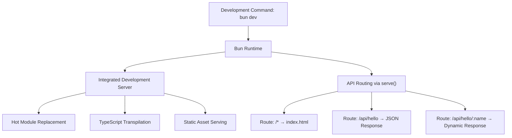
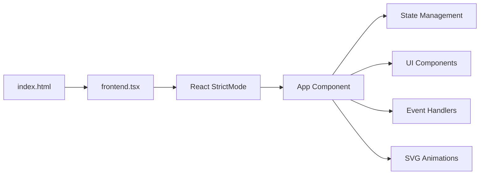
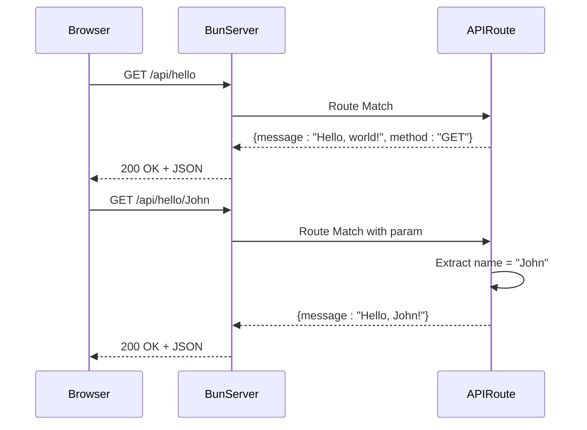
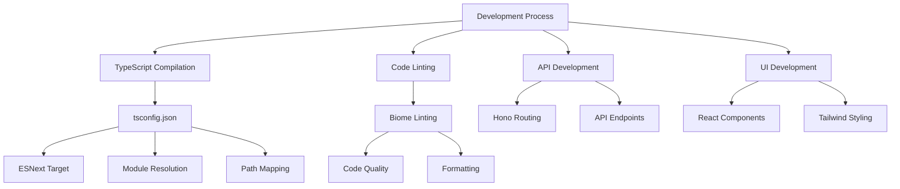

# Technology Stack & Dependencies

<cite>
**Referenced Files in This Document**   
- [package.json](file://package.json)
- [tsconfig.json](file://tsconfig.json)
- [bunfig.toml](file://bunfig.toml)
- [README.md](file://README.md)
- [src/App.tsx](file://src/App.tsx)
- [src/index.tsx](file://src/index.tsx)
- [src/frontend.tsx](file://src/frontend.tsx)
- [src/index.html](file://src/index.html)
- [src/index.css](file://src/index.css)
- [bun-env.d.ts](file://bun-env.d.ts)
</cite>

## Table of Contents
1. [Core Technology Stack](#core-technology-stack)
2. [Runtime & Development Environment](#runtime--development-environment)
3. [Frontend Architecture](#frontend-architecture)
4. [API & Backend Services](#api--backend-services)
5. [Build & Tooling Ecosystem](#build--tooling-ecosystem)
6. [Configuration & Optimization](#configuration--optimization)
7. [Monorepo & Dependency Management](#monorepo--dependency-management)

## Core Technology Stack

The project leverages a modern, high-performance technology stack designed for full-stack development with optimal developer experience and runtime efficiency. The architecture combines React 19 for component-based UI development, Bun as a unified JavaScript runtime, Hono for API routing, TypeScript for type safety, Tailwind CSS for utility-first styling, and Lucide React for consistent iconography. This combination enables rapid development, excellent performance, and maintainable code across both frontend and backend domains.

**Section sources**
- [package.json](file://package.json#L26-L28)
- [src/App.tsx](file://src/App.tsx#L1-L206)
- [src/index.tsx](file://src/index.tsx#L1-L41)

## Runtime & Development Environment

### Bun Runtime
Bun serves as the unified runtime for both frontend and backend execution, replacing traditional Node.js+Webpack setups with an integrated development server, bundler, and test runner. As specified in the package.json, the project uses Bun 1.2.18 (`"packageManager": "bun@1.2.18"`), which provides native TypeScript support, JavaScript bundling, and a fast web server out of the box.

Bun eliminates the need for separate build tools by providing first-class support for TypeScript, JSX, and CSS imports without configuration. The runtime's performance optimizations target a 50x improvement over standard Node.js, as indicated in the bunfig.toml comments. Bun's integrated development server supports hot module replacement (HMR) through the `--hot` flag in development scripts.

### Development Workflow
The development workflow is streamlined through Bun's unified command interface:
- `bun dev`: Starts the development server with HMR enabled
- `bun run --hot apps/api-gateway/server.ts`: Development script that runs the API gateway with hot reloading
- `bun test`: Executes tests with built-in test runner
- `bun start`: Production startup command

The environment variables in bunfig.toml set `NODE_ENV = "development"` and `RUNTIME = "bun"` to ensure proper runtime configuration.



**Diagram sources**
- [package.json](file://package.json#L13)
- [bunfig.toml](file://bunfig.toml#L15-L17)
- [src/index.tsx](file://src/index.tsx#L4-L41)

**Section sources**
- [package.json](file://package.json#L7)
- [bunfig.toml](file://bunfig.toml#L1-L17)
- [README.md](file://README.md#L11-L13)

## Frontend Architecture

### React 19 & Component Model
The frontend is built with React using a component-based architecture. The App.tsx file demonstrates a sophisticated React component that manages state for different operational modes (Executive, Technical, Creative) and agent interactions. React 19 features such as concurrent rendering and enhanced hooks are leveraged for smooth UI performance.

The component structure follows modern React patterns:
- Functional components with hooks (useState, useEffect)
- Icon integration via Lucide React
- CSS-in-JS styling with Tailwind classes
- Responsive design principles

### Entry Point & Rendering
The frontend entry point is defined in frontend.tsx, which sets up the React root and renders the App component to the DOM element with ID "root". The file implements conditional logic for hot module reloading in development versus standard rendering in production, maximizing development efficiency while ensuring production stability.

The index.html file serves as the HTML template, linking to the frontend entry point via a module script tag that references frontend.tsx directly—demonstrating Bun's ability to handle TypeScript files without pre-bundling.



**Diagram sources**
- [src/frontend.tsx](file://src/frontend.tsx#L8-L27)
- [src/index.html](file://src/index.html#L1-L13)
- [src/App.tsx](file://src/App.tsx#L19-L205)

**Section sources**
- [src/App.tsx](file://src/App.tsx#L1-L206)
- [src/frontend.tsx](file://src/frontend.tsx#L1-L27)
- [src/index.html](file://src/index.html#L1-L14)

## API & Backend Services

### Hono for API Routing
The backend API is implemented using Hono, a lightweight and fast web framework optimized for Bun. In index.tsx, the `serve()` function from Bun creates an HTTP server with route definitions that handle API requests. The implementation demonstrates RESTful routing patterns with support for:
- Static routes (/api/hello)
- HTTP method dispatching (GET, PUT)
- Dynamic parameterized routes (/api/hello/:name)
- JSON response formatting

The API server is configured to serve the index.html file for all unmatched routes, enabling client-side routing for the React application while providing dedicated endpoints for API functionality.

### API Testing Interface
The APITester.tsx component provides a built-in interface for testing API endpoints, allowing developers to send requests to various endpoints and view responses. This demonstrates a self-contained development environment where API testing is integrated directly into the application.



**Diagram sources**
- [src/index.tsx](file://src/index.tsx#L9-L29)
- [src/APITester.tsx](file://src/APITester.tsx#L6-L22)

**Section sources**
- [src/index.tsx](file://src/index.tsx#L1-L41)
- [src/APITester.tsx](file://src/APITester.tsx#L1-L40)

## Build & Tooling Ecosystem

### TypeScript Configuration
The TypeScript configuration in tsconfig.json enables modern development features:
- `"target": "ESNext"` for latest JavaScript features
- `"module": "Preserve"` to maintain module structure
- `"moduleResolution": "bundler"` for compatibility with Bun
- `"jsx": "react-jsx"` for React 19 support
- Path mapping `"@/*": ["./src/*"]` for clean imports
- Strict type checking with `"strict": true`

This configuration ensures type safety across the codebase while enabling modern language features and efficient module resolution.

### Key Dependencies
The project leverages several critical dependencies for enhanced functionality:

#### zod (Schema Validation)
zod provides TypeScript-first schema validation for runtime type checking. While not explicitly shown in the current code, it's included as a dependency for validating API inputs, configuration objects, and data structures with compile-time type inference.

#### tsup (Build Tool)
tsup serves as the production build tool, configured in the package.json scripts under `"build": "tsup"`. This lightweight wrapper around esbuild provides fast, zero-configuration builds for TypeScript projects, generating optimized bundles for production deployment.

#### @biomejs/biome (Linting)
Biome replaces traditional ESLint/Prettier setups with a unified tool for code formatting, linting, and minification. The package.json scripts include:
- `"lint": "biome check ."` - Run linting checks
- `"lint:apply": "biome check --apply ."` - Automatically fix issues

Biome offers significantly faster performance compared to traditional tooling while providing comprehensive code quality enforcement.



**Diagram sources**
- [tsconfig.json](file://tsconfig.json#L1-L18)
- [package.json](file://package.json#L15-L17)

**Section sources**
- [tsconfig.json](file://tsconfig.json#L1-L18)
- [package.json](file://package.json#L20-L23)

## Configuration & Optimization

### bunfig.toml
The bunfig.toml file contains runtime configuration that optimizes Bun's performance and behavior:
- **Install Configuration**: Enables caching and lockfile generation for faster dependency installation
- **Runtime Configuration**: Sets environment variables for development mode
- **Test Configuration**: Enables coverage reporting for testing

The configuration is specifically tuned for the project's performance goals, with comments indicating a target of 50x performance improvement over standard Node.js.

### CSS & Styling
The project uses a hybrid approach to styling:
- **Tailwind CSS**: Utility-first classes for rapid UI development (evident in App.tsx class names)
- **CSS Modules**: Support declared in bun-env.d.ts for type-safe CSS modules
- **Global Styles**: index.css provides base styling and animations

The index.css file demonstrates sophisticated styling techniques including:
- CSS animations (spin, slide, pulse)
- Pseudo-elements for background effects
- Responsive design principles
- Dark mode support
- Focus states and hover effects

```mermaid
classDiagram
class bunfig_toml {
+install.cache : true
+install.lockfile : true
+runtime.env : {NODE_ENV, RUNTIME}
+test.coverage : true
}
class tsconfig_json {
+compilerOptions.target : "ESNext"
+compilerOptions.module : "Preserve"
+compilerOptions.moduleResolution : "bundler"
+compilerOptions.jsx : "react-jsx"
+compilerOptions.baseUrl : "."
+compilerOptions.paths : {"@/*" : ["./src/*"]}
+compilerOptions.strict : true
}
class package_json_scripts {
+dev : "bun run --hot apps/api-gateway/server.ts"
+test : "bun test"
+build : "tsup"
+lint : "biome check ."
+lint : apply : "biome check --apply ."
}
bunfig_toml --> package_json_scripts : "configures"
tsconfig_json --> package_json_scripts : "enables"
package_json_scripts --> bunfig_toml : "uses"
package_json_scripts --> tsconfig_json : "requires"
```

**Diagram sources**
- [bunfig.toml](file://bunfig.toml#L1-L17)
- [tsconfig.json](file://tsconfig.json#L1-L18)
- [package.json](file://package.json#L12-L18)

**Section sources**
- [bunfig.toml](file://bunfig.toml#L1-L17)
- [tsconfig.json](file://tsconfig.json#L1-L18)
- [src/index.css](file://src/index.css#L1-L188)

## Monorepo & Dependency Management

### Monorepo Structure
The project is configured as a monorepo with the workspaces field in package.json specifying:
- `packages/*` - For shared libraries and utilities
- `apps/*` - For individual applications or services

This structure enables code sharing across multiple packages while maintaining independent versioning and deployment capabilities. The monorepo approach facilitates the development of the "371-OS: Revolutionary Autonomous Agent Operating System" as a collection of coordinated services rather than a single monolithic application.

### Dependency Management
The dependency strategy follows modern best practices:
- **Production Dependencies**: Minimal runtime requirements (hono, zod, lucide-react)
- **Development Dependencies**: Comprehensive tooling (biome, tsup, typescript, @types/node)
- **Version Pinning**: Specific versions for critical tools (biome 1.8.3)
- **Semantic Versioning**: Caret ranges for libraries to allow compatible updates

The package.json clearly separates dependencies by concern, ensuring that production bundles remain lean while development environments have all necessary tooling. The use of Bun as the package manager (specified in packageManager field) ensures consistent installation behavior across environments.

**Section sources**
- [package.json](file://package.json#L8-L11)
- [package.json](file://package.json#L19-L29)