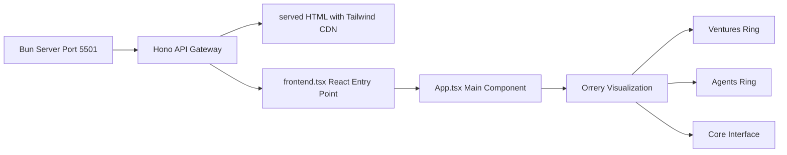

# UI Fix Plan for 371-OS Orrery Visualization

## Problem Analysis
The 371-OS Orrery visualization has multiple UI issues:
1. **Tailwind CSS not loading** - The standalone [`src/index.html`](../src/index.html) lacks the Tailwind CDN
2. **Pulse animations not working** - Missing or incomplete animation definitions
3. **Layout/positioning issues** - Orrery rings, agents, and tooltips may not render correctly

## Architecture Overview



## Implementation Steps

### 1. Fix Tailwind CSS Loading in src/index.html
**File**: [`src/index.html`](../src/index.html)

Add the Tailwind CSS CDN script:
```html
<script src="https://cdn.tailwindcss.com"></script>
```

Add pulse animation styles:
```css
<style>
  @keyframes pulse {
    0%, 100% { opacity: 1; transform: scale(1); }
    50% { opacity: 0.5; transform: scale(1.05); }
  }
</style>
```

Update page title to match branding:
```html
<title>371-OS: Cognitive-Aware Autonomous Agent OS</title>
```

### 2. Fix Pulse Animations
**Files**: [`src/index.html`](../src/index.html), [`apps/api-gateway/server.ts`](../apps/api-gateway/server.ts)

Ensure consistent animation keyframes across both files:
- Add complete pulse animation with both opacity and scale
- Add starfield animation for background effect

### 3. Fix Layout and Positioning Issues
**File**: [`src/App.tsx`](../src/App.tsx)

Verify and fix:
- Orrery outer ring (Ventures) - positioned at 280px radius
- Orrery middle ring (Agents) - positioned at 200px radius  
- Core interface - centered with proper z-index (z-30)
- Agent tooltips - fixed positioning with higher z-index (z-40)
- Infrastructure labels - bottom positioning (-bottom-32)
- Mode toggle buttons - absolute positioning below core (-bottom-16)

### 4. Update App.tsx Styling
**File**: [`src/App.tsx`](../src/App.tsx)

Enhancements:
- Add explicit z-index values for layering
- Improve hover state transitions
- Fix tooltip positioning (currently may overlap orrery)
- Ensure responsive sizing for smaller screens
- Add backdrop blur effects for better readability

### 5. Test UI Fixes
Verification checklist:
- Tailwind CSS classes are applied correctly
- Pulse animations work on starfield and core brain icon
- Orrery rings spin in correct directions (outer clockwise, middle counter-clockwise)
- Agent tooltips appear on hover with correct positioning
- Mode switching buttons work and update the core interface
- Infrastructure labels display at bottom
- Color schemes apply correctly for each mode (Executive=blue, Technical=emerald, Creative=purple)

## Key Files to Modify
1. [`src/index.html`](../src/index.html) - Add Tailwind CDN and animation styles
2. [`src/App.tsx`](../src/App.tsx) - Fix layout positioning and z-index issues
3. [`apps/api-gateway/server.ts`](../apps/api-gateway/server.ts) - Ensure consistent HTML template (may already be correct)

## Files NOT to Modify
- [`src/frontend.tsx`](../src/frontend.tsx) - Entry point, no changes needed
- [`src/index.css`](../src/index.css) - Legacy CSS, not used with Tailwind approach
- [`src/index.tsx`](../src/index.tsx) - Bun server file, different entry point